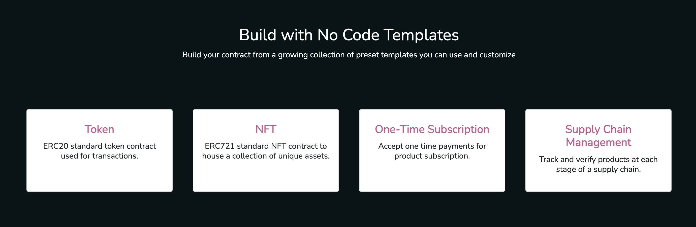
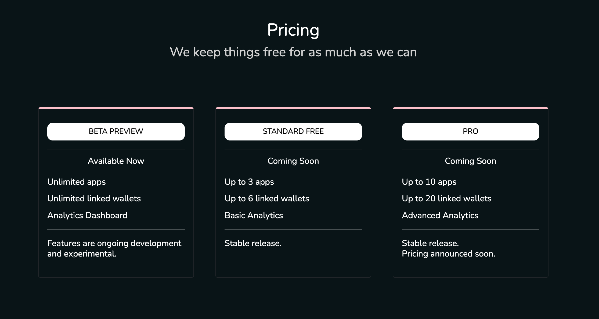
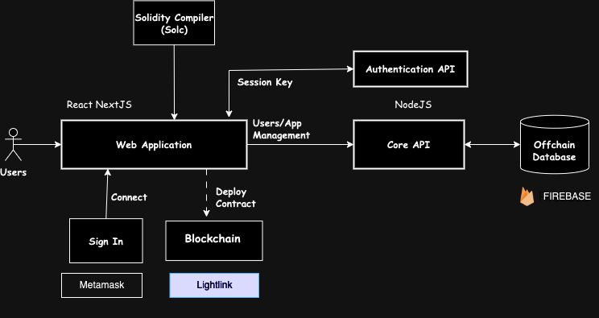
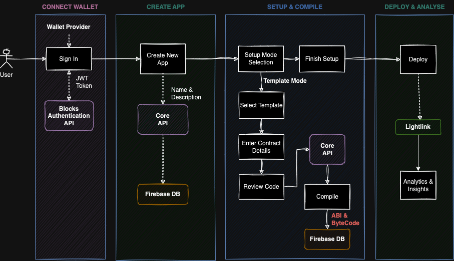
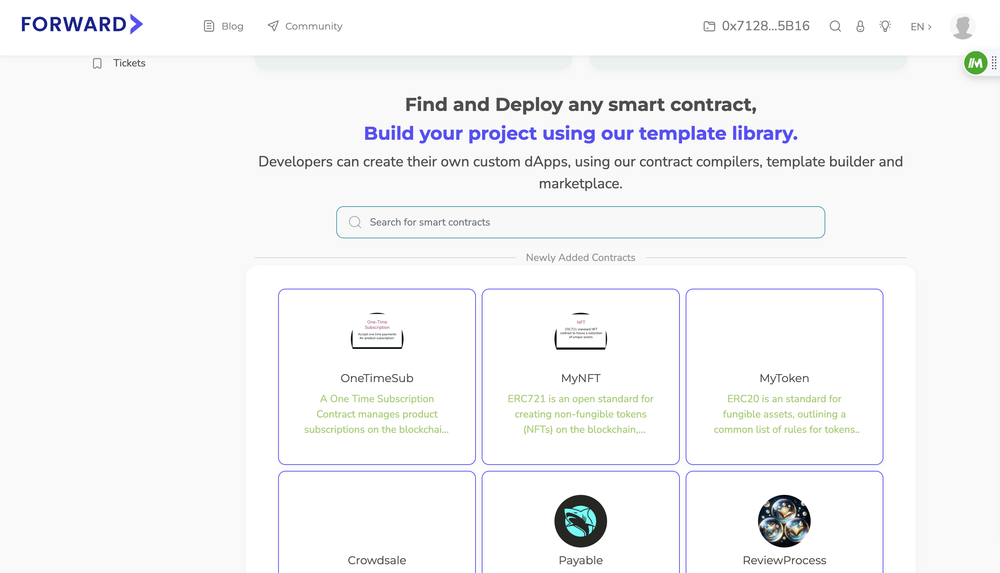
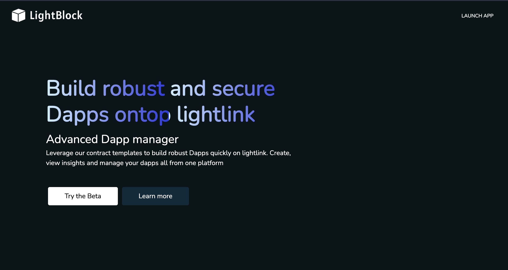
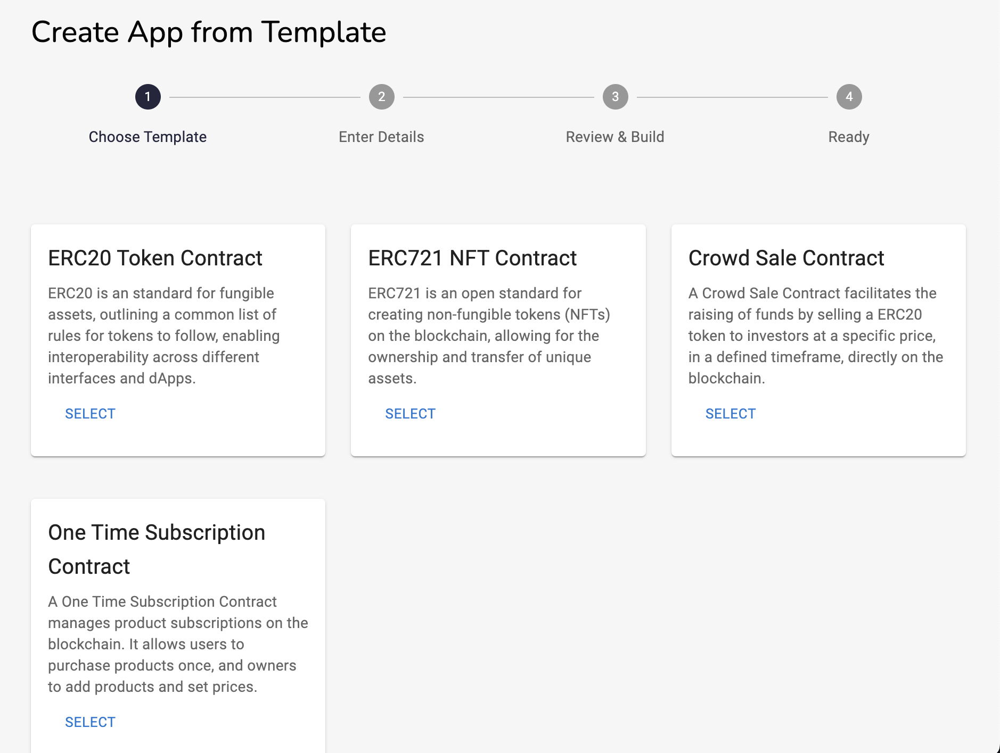
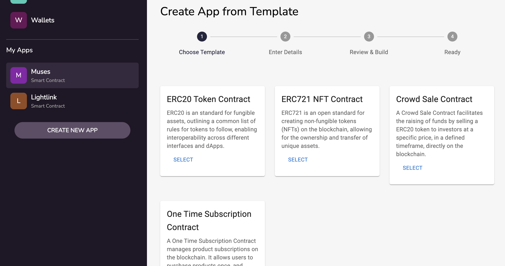
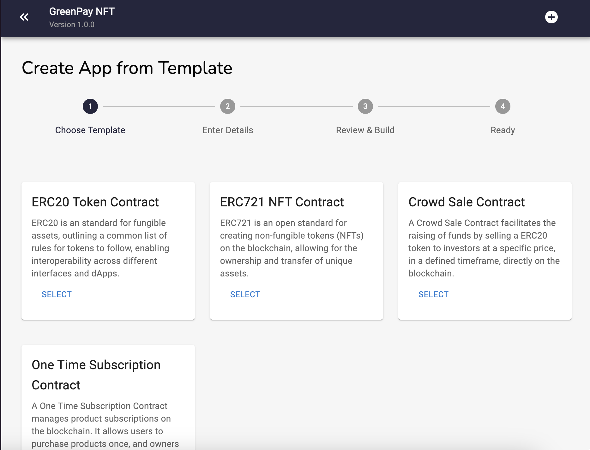

# LightBlock - Built at Lightlink gasless hackathon '24

## Enterprise mode deployment
0x74229971e39a85095966e33ffdcc615c882f1dfa90006366bc88b0bee2d8a37b

## LightBlock simplifies creating, compiling, deploying and managing smart contracts.

**Project Goal**: Building on web3 is hard, building robust and secure Dapps a lot more harder. We wanted to give anyone the ability to quickly build, test and ship their Dapps ontop lightlink regardless of their skill level.

**Project Website**: [website](https://lightblock-omega.vercel.app/)

**Please note**: This alpha version of the application is for testing and development purposes only. The final version may differ significantly in terms of features, appearance, and functionality.

## About the Project

LightBlock is a user-friendly blockchain app builder and manager for **Lightink** blockchain. It enables effortless creation, deployment, management, and analysis of smart contracts for both beginners and expert blockchain engineers. 

With no-code templates, multiple wallet integrations, and robust analytics, it caters to both beginners and advanced users, democratizing access to blockchain technology and paving the way for a more decentralized digital future.

## Features

    

    

**No Code Contract Builder**
- Build your contracts from a growing collection of preset templates you can use and customize, no coding required.

**App Manager**
- Create multiple apps, each having their own smart contract properly organized providing you with a holistic view of your dapps.

**Build in Solidity Compiler**
- Compile your smart contracts directly on the platform.

**Build in Contract Deployer**
- Deploy on Lightink mainnet and testnet with just a button click.

**Coming Soon**
- For advanced users: Build contracts with custom code.
- Import existing contracts that has been deployed.
- Link multiple wallets
- App version management
- Contract Analytics and Insights
- Frontend templates

## Business Model

    

While we strive to keep the majority of features free so anyone can experience and use LightBlock, we plan to introduce a freemium model in the future to sustain the project's development. The platform will still remain free for basic use, and allows unlimited restrictions for paid users.

**Community Contributed Templates**: We are also considering to open up our templates collection so other developers can build and share their templates and possibly earn commission from their use.

## Technical Details

### Architecture Overview

    

#### Web Application & APIs

- The frontend Web Application is developed in **React** using the **NextJS** framework. The authentication and core APIs are developed in NodeJS.
- These applications are hosted on [Vercel](https://www.vercel.com).

#### Compiler
- [Solidity Compiler (Solc)](https://www.npmjs.com/package/solc) is used for compiling Solidity code into Contract Application Binary Image (ABI) and byte code.

#### Contract Interactions/Deployments
- [Web3.js](https://github.com/web3/web3.js) is the library we use for all contract interactions, including deployments.

#### Offchain Database

- The offchain database is used to store the encrypted messages and various operations of the application. 
- The database is hosted on [Google Firebase](https://firebase.google.com) using the Firestore service.

### Process Flow

    

#### Connect Wallet & Handshaking
- Users first connect to Lightink Blockchain using a wallet provider like metamask. After connecting, user then signs a message to the Authentication API, which verifies the signed message and returns a generated JWT token for access to the Core API.

#### Creating an App
- Users would create their first app after accessing the platform. An app is a container that will hold and manage the smart contract. Users can create multiple apps.

#### Contract Details & Compilation
- Setting up an app is quick easy with only a few steps: selecting mode (build from template, custom code, or existing contract import).
- In Build from Template, the steps would require selecting a template, entering contract details, review generated code and compile.

#### Publishing
- Once a contract is compiled within an app, it can be deployed with just a click. Apps deployed can then collect tranasction data from the blockchain for insights and analytics.

## Project Roadmap

**Q1 2024**
- Project inception, planning and prototyping
- MVP product engineering and development
- More templates from community 
- Beta launch on mainnet

**Q2 & Q3 2023**
- Feature implementation and refinements
    - Version management, wallet management, analytics and insights
    - Contract import and custom code
    - More preset templates
- Public outreach and marketing
- Launch of complete and stable version on mainnet

## Forward Deployment 

ALl our dapp templates have been deployed and listed on forward marketplace, available for developers to use to get started building their Dapps

    

## Screenshots

    

    

    

    

